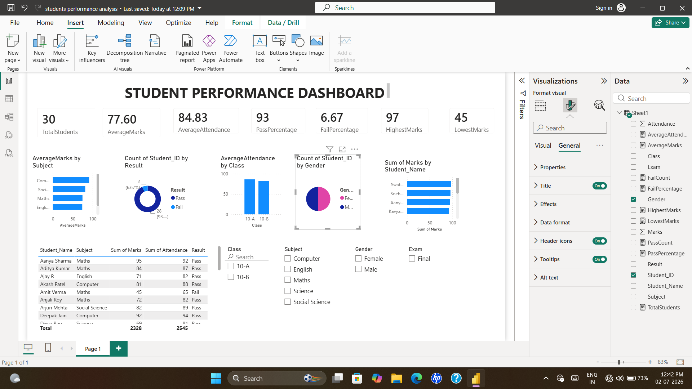

# Student Performance Dashboard using Power BI

## Project Overview
This project analyzes student academic performance using Power BI.

## Tools Used
- Power BI Desktop
- Microsoft Excel

## Features
- Total Students KPI
- Average Marks
- Average Attendance
- Pass Percentage
- Fail Percentage
- Highest Marks
- Lowest Marks
- Subject-wise Performance
- Attendance Analysis
- Top Performers
- Interactive Slicers

## Dataset
The dataset contains:
- Student ID
- Student Name
- Gender
- Class
- Subject
- Marks
- Attendance
- Exam
- Result

## Dashboard Preview

## Author
Soundarya
